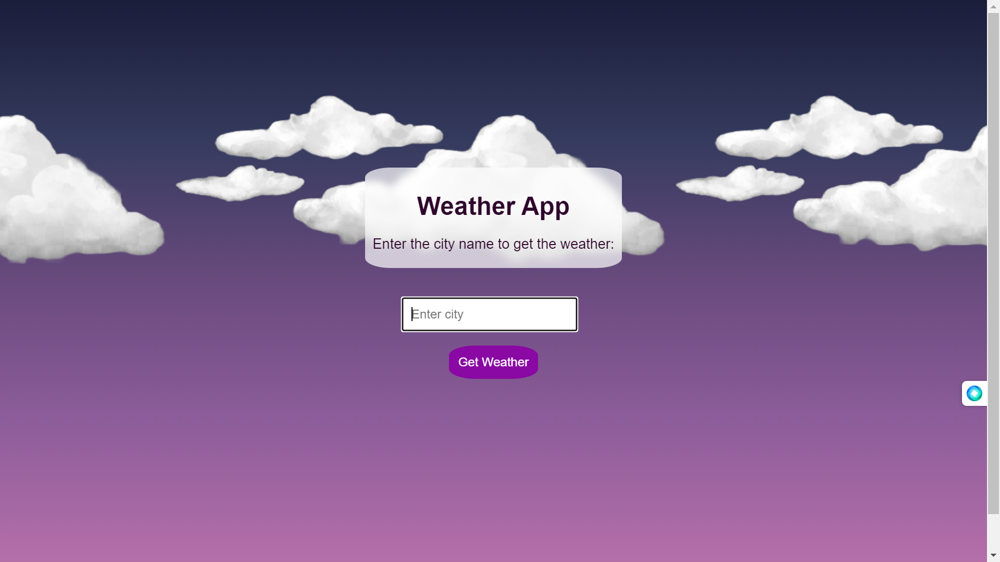
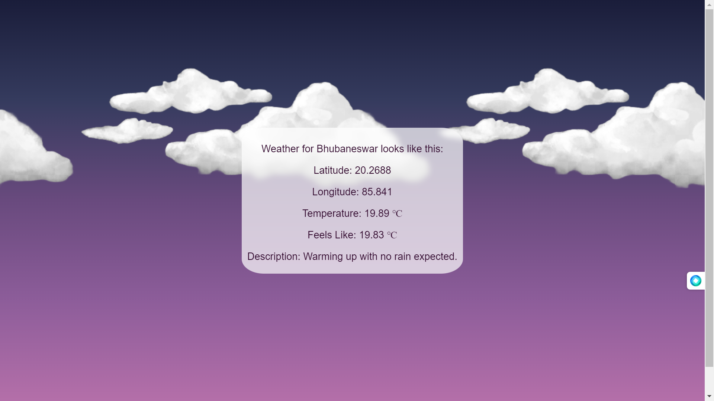

# Weather App

This is a simple web application built with Flask that allows users to check the weather for a specific city. The app uses the Visual Crossing Weather API to retrieve weather information.

## Try it Online

You can access the live version of the app hosted on [https://weather-app-brahma.koyeb.app/](https://weather-app-brahma.koyeb.app/).

## Screenshots





## Setup and Installation

1. Clone the repository to your local machine:

   ```bash
   git clone https://github.com/yourusername/weather-app.git
   ```

2. Navigate to the project directory:

   ```bash
   cd weather-app
   ```

3. Install the required dependencies using pip:

   ```bash
   pip install -r requirements.txt
   ```

4. Run the Flask application:

   ```bash
   python app.py
   ```

   The application will be accessible at [http://localhost:5000/](http://localhost:5000/) in your web browser.

## Usage

1. Open the application in your web browser.

2. Enter the name of the city for which you want to check the weather in the provided input field.

3. Click the "Get Weather" button.

4. The application will display information such as latitude, longitude, temperature, feels-like temperature, and weather description for the specified city.

## Files and Directory Structure

- **app.py**: The main Flask application file that handles routing and interacts with the Visual Crossing Weather API.

- **templates/index.html**: The HTML template for the home page, where users can input the city name.

- **templates/result.html**: The HTML template for displaying weather information after submitting the form.

- **static/styles/styles.css**: CSS file for styling the HTML templates.

## External API

The application uses the Visual Crossing Weather API to fetch weather data. You need to provide your API key when making requests to the API. You can obtain an API key by signing up on the Visual Crossing Weather website.

## License

This project is licensed under the [MIT License](LICENSE).

Feel free to contribute, report issues, or suggest improvements!
